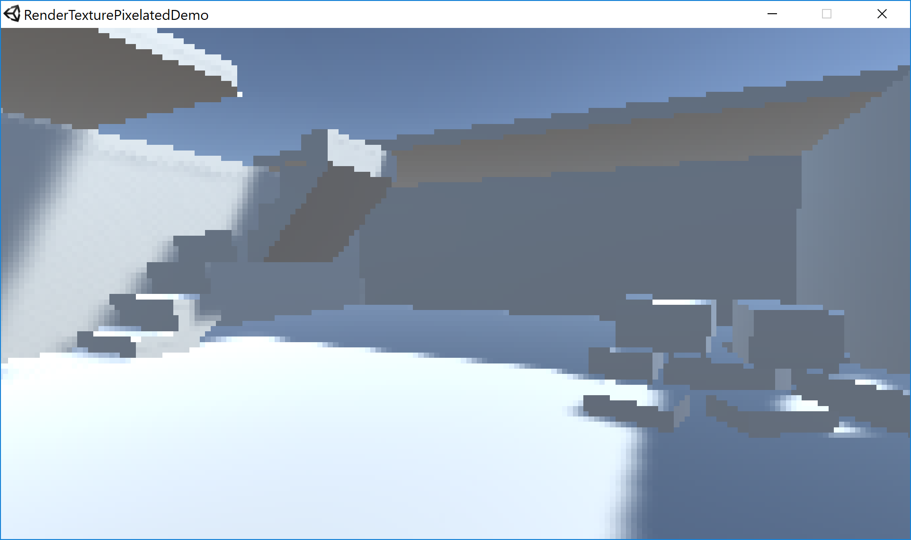

# UnityPixelated3DDemo
Pixelated 3D look in Unity3D (using RenderTexture)

Made in Unity 5.6.0f3.
This is an implementation of [this tutorial by Iain Dowling on how to get this pixelated effect using render textures](https://iaindowling.weebly.com/blog/unity-pixelated-render-effect) -- I thought it would be nice to have a working implementation as a starting point.

The demo environment mesh was made using [Asset Forge](http://assetforge.io/) (quickly thrown together, it does not nearly showcase all of the Asset Forge features)